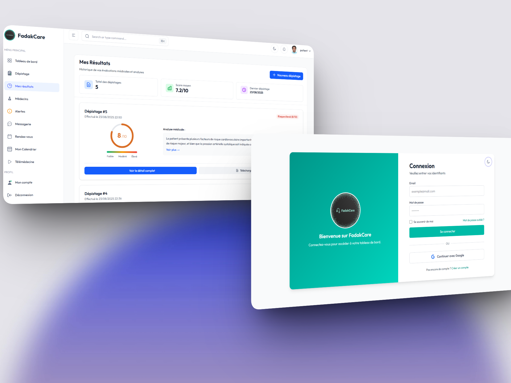

# FadakCare - Plateforme de Télémédecine et Soins de Santé

FadakCare est une plateforme complète de télémédecine et de gestion des soins de santé, construite avec **React, TypeScript et Tailwind CSS**. La plateforme offre une solution intégrée pour les patients, médecins et administrateurs, facilitant l'accès aux soins de santé à distance et la gestion médicale moderne.

Avec FadakCare, vous avez accès à toutes les fonctionnalités nécessaires pour gérer les consultations médicales, le suivi des patients, les dépistages, les alertes médicales et bien plus encore. Que vous soyez un professionnel de santé ou un patient, FadakCare simplifie et modernise votre expérience des soins de santé.



## Vue d'ensemble

FadakCare est une plateforme de télémédecine moderne qui fournit des composants essentiels et des interfaces pour gérer les soins de santé à distance. Elle comprend des fonctionnalités pour :

- **Patients** : Prise de rendez-vous, consultations vidéo, suivi médical
- **Médecins** : Gestion des patients, consultations en ligne, prescriptions
- **Administrateurs** : Tableau de bord, gestion des utilisateurs, statistiques

La plateforme est construite avec :

- React 19
- TypeScript  
- Tailwind CSS
- ASP.NET Core (Backend)
- SignalR (Communications temps réel)

### Fonctionnalités principales

- 🏥 **Consultations en ligne** - Rendez-vous vidéo sécurisés entre patients et médecins
- 📋 **Gestion des patients** - Dossiers médicaux électroniques complets
- � **Dépistage médical** - Questionnaires de santé et évaluations préliminaires  
- 🚨 **Système d'alertes** - Notifications médicales urgentes en temps réel
- 💬 **Messagerie sécurisée** - Communication chiffrée entre utilisateurs
- 📊 **Tableaux de bord** - Analyses et statistiques pour les professionnels
- 🔐 **Authentification sécurisée** - Connexion via email/mot de passe ou Google OAuth
- 📱 **Interface responsive** - Optimisé pour desktop, tablette et mobile

### Démos

Accédez aux différentes interfaces de la plateforme :
- Interface Patient
- Interface Médecin  
- Interface Administrateur

## Installation

### Prérequis

Pour commencer avec FadakCare, assurez-vous d'avoir les prérequis suivants installés :

- Node.js 18.x ou version ultérieure (Node.js 20.x recommandé)
- .NET 8 ou version ultérieure (pour le backend)
- SQL Server ou PostgreSQL (pour la base de données)

### Clonage du repository

Clonez le repository en utilisant la commande suivante :

```bash
git clone https://github.com/votre-repo/fadakcare-plateforme.git
```

> Utilisateurs Windows : placez le repository près de la racine de votre disque si vous rencontrez des problèmes lors du clonage.

### Configuration du Frontend (React)

1. Naviguez vers le dossier frontend :
   ```bash
   cd "fadakcare web"
   ```

2. Installez les dépendances :
   ```bash
   npm install
   # ou
   yarn install
   ```

   > Utilisez le flag `--legacy-peer-deps` si vous rencontrez des problèmes lors de l'installation.

3. Démarrez le serveur de développement :
   ```bash
   npm run dev
   # ou
   yarn dev
   ```

### Configuration du Backend (ASP.NET Core)

1. Naviguez vers le dossier backend :
   ```bash
   cd backend
   ```

2. Restaurez les packages NuGet :
   ```bash
   dotnet restore
   ```

3. Configurez la base de données dans `appsettings.json`

4. Appliquez les migrations :
   ```bash
   dotnet ef database update
   ```

5. Démarrez l'API :
   ```bash
   dotnet run
   ```

### Configuration du Serveur de Signalisation

1. Naviguez vers le dossier signaling-server :
   ```bash
   cd signaling-server
   ```

2. Installez les dépendances :
   ```bash
   npm install
   ```

3. Démarrez le serveur :
   ```bash
   npm start
   ```

## Architecture de la Plateforme

FadakCare est conçue comme une solution complète de télémédecine avec une architecture moderne :

### Frontend (React)
- Interface utilisateur intuitive et responsive
- Gestion d'état avec Context API
- Routing avec React Router
- Composants UI réutilisables avec Tailwind CSS
- Intégration WebRTC pour les appels vidéo
- Authentification JWT sécurisée

### Backend (ASP.NET Core)
- API RESTful avec Entity Framework Core
- Authentification JWT et OAuth2 (Google)
- SignalR pour les communications temps réel
- Gestion des fichiers et uploads
- Système de notifications push
- Architecture en couches (Controllers, Services, Models)

### Base de données
- Modèles relationnels pour patients, médecins, consultations
- Gestion des rendez-vous et historiques médicaux
- Système d'alertes et notifications
- Sécurité et conformité des données médicales

### Fonctionnalités Incluses

- **Authentification et autorisation** complètes
- **Gestion des profils** patients et médecins  
- **Système de rendez-vous** avec calendrier intégré
- **Consultations vidéo** sécurisées
- **Messagerie** chiffrée entre utilisateurs
- **Dépistage médical** avec questionnaires
- **Système d'alertes** médicales urgentes
- **Tableaux de bord** avec statistiques
- **Mode sombre** 🌙

## Versions et Fonctionnalités

### Version Actuelle

- 3 Interfaces utilisateur distinctes (Patient, Médecin, Admin)
- 50+ composants UI spécialisés pour la télémédecine
- 30+ éléments d'interface utilisateur
- Système complet d'authentification et autorisation
- Intégration WebRTC pour consultations vidéo
- Support technique et documentation complète

### Fonctionnalités Avancées

- 5 Tableaux de bord spécialisés : Patients, Médecins, Administrateur, Consultations, Analyses
- 100+ composants médicaux spécialisés
- Système de notifications en temps réel
- Intégration avec systèmes de santé existants
- Conformité RGPD et sécurité médicale renforcée

Pour en savoir plus sur les fonctionnalités et la roadmap, contactez l'équipe de développement.

## Historique des Versions

### Version 1.0.0 - [Septembre 2025]

#### Fonctionnalités Principales

- Lancement de la plateforme de télémédecine FadakCare
- Interface complète pour patients, médecins et administrateurs
- Système d'authentification avec JWT et Google OAuth
- Consultations vidéo sécurisées avec WebRTC
- Gestion des rendez-vous et calendrier intégré

#### Composants Techniques

- Frontend React avec TypeScript et Tailwind CSS
- Backend ASP.NET Core avec Entity Framework
- Base de données SQL Server avec migrations
- Serveur de signalisation pour les appels vidéo
- Système de notifications temps réel avec SignalR

#### Fonctionnalités Médicales

- Dossiers patients électroniques
- Système de dépistage avec questionnaires
- Alertes médicales urgentes
- Messagerie sécurisée entre utilisateurs
- Tableaux de bord avec analyses et statistiques

#### Sécurité et Conformité

- Chiffrement des données médicales
- Conformité RGPD et réglementations de santé
- Authentification multi-facteurs
- Logs d'audit complets
- Sauvegarde automatique des données

### Prochaines Versions

- Intégration avec systèmes de santé existants
- Application mobile native
- IA pour assistance au diagnostic
- Télémédecine spécialisée par domaines
- Intégration avec dispositifs IoT médicaux

## Licence

FadakCare est un projet développé pour révolutionner l'accès aux soins de santé. Consultez les termes de licence pour plus d'informations sur l'utilisation commerciale et la distribution.

## Support et Contribution

Si vous trouvez ce projet utile, n'hésitez pas à :

- ⭐ Donner une étoile sur GitHub
- 🐛 Signaler des bugs ou proposer des améliorations
- 🤝 Contribuer au développement
- 📧 Contacter l'équipe pour support technique

Votre soutien nous aide à continuer à développer et maintenir cette plateforme innovante de télémédecine.

## Contact

Pour toute question technique ou proposition de collaboration :
- Email : support@fadakcare.com
- Documentation : [docs.fadakcare.com](https://docs.fadakcare.com)
- Issues GitHub : [github.com/fadakcare/issues](https://github.com/fadakcare/issues)
